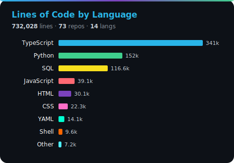
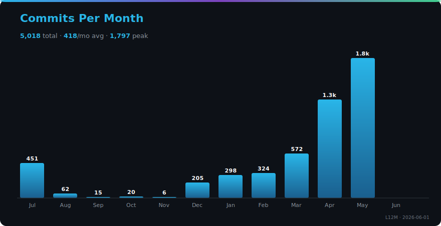
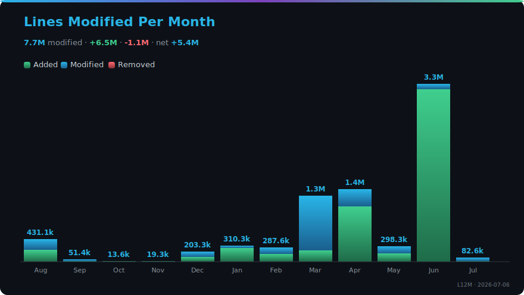
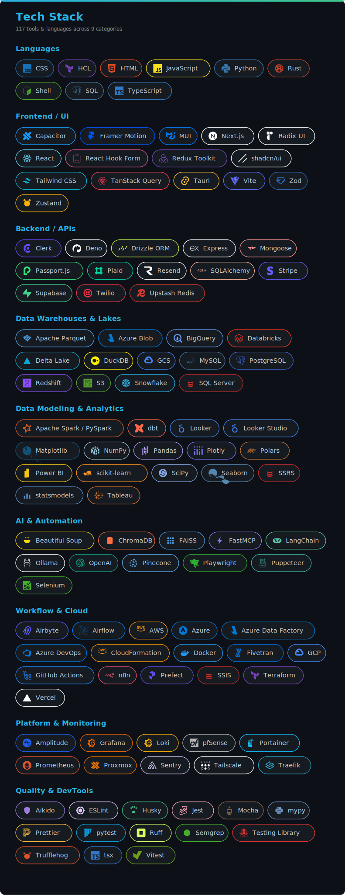

<!-- LOC-CHART-START -->

<picture>
  <source media="(max-width: 600px)" srcset="./loc-chart-mobile.svg">
  
</picture>

<!-- LOC-CHART-END -->

<!-- ACTIVITY-CHART-START -->

<picture>
  <source media="(max-width: 600px)" srcset="./commits-chart-mobile.svg">
  
</picture>

<picture>
  <source media="(max-width: 600px)" srcset="./churn-chart-mobile.svg">
  
</picture>

<!-- ACTIVITY-CHART-END -->

<!-- TECH-STACK-START -->

<picture>
  <source media="(max-width: 600px)" srcset="./tech-stack-mobile.svg">
  
</picture>

<!-- TECH-STACK-END -->
